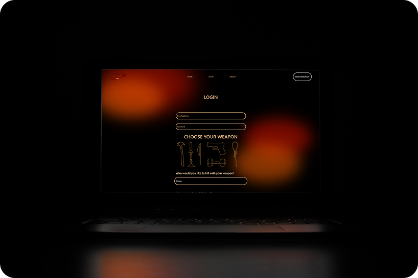
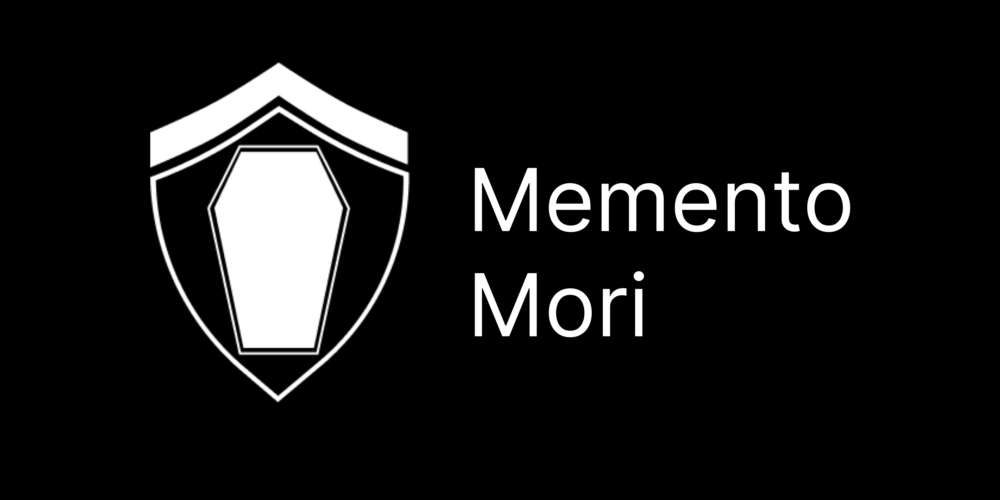

# About Me

Hello, I'm Onthatile Lesufi, in certain corners of cyberspace I go by MrNineFrames (or Mr.9 for short). I am currently an aspiring developer whose is studying in both the fields of web development and game development (with a minor in basic electrical engineering) at university. This Github page consists of all of my web development projects.

# My Skills
- ### Multi-Language Proficiency
  
  
  

Thanks to the wide spread of my studies I have proficeincy over multiple programming languages. This include: 
- Javascript for web development
- C# for game development
- C++ for electrical engineering
  
- ### CRUD Development
  
  
  
  
  

On top of my proficiency with the MERN stack, I am also knowledgeable with other CRUD related softwares such as MySQL
  
- ### Deployent
  

I have proficiency with deployment primarily relating to Heroku.
  
- ### Multi-Platform Proficiency
  
  
  

On top of my proficeincy in web development, I am also proficient in multiple other programming paradigms such as game development and Arduino.

# Featured Projects

#### The following section will cover my featured projects over the year.

---

## [Yu-Gi-Oh! Price Tracker](https://github.com/Onthatile-Lesufi/formative-one-YuGiOh_Price_Tracker)

Yu-Gi-Oh!™ Price Tracker allows users to browse various Yu-Gi-Oh!™ cards, analyse their various market factors and compare them to other cards. Market factors include:

- Prices across varies digital stores

- Average pricing

- Popularity metrics on https://ygoprodeck.com:
  - Total views
  - Recent views
  - Upvotes
  - Downotes
  - Number of reprintings in the form of set releases

## [Hit Me Up](https://github.com/Onthatile-Lesufi/hit-me-up)

The Hit Me Up page is a bold, dark-humored contact and service page for the fictional Hitman site. It allows users to sign up or log in to their account in order to book a hitman or purchase weapons. The page is designed with an edgy, underground aesthetic to match the theme, while maintaining clean layout and functionality. It's the gateway for users to enter the darker side of business—discreet, direct, and deadly efficient.

## [Memento Mori](https://github.com/Onthatile-Lesufi/Memento-Mori)

Memento Mori is a repository of graves, graveyards, cemeteries and memorials across South Africa. It allows users to get access to the address and appearances of the various burial sites. This is all with the goal of making sure that the burials of loved ones will never be lost to the page of time and poor memory.

Currently Memento Mori is being hosted on the internet. You can the website at: https://mementomorisa.co.za/

# Contact Me
- Email: onthatumi@outlook.com

### Additional Platforms
- [Instagram](https://www.instagram.com/mrnineframes/)
- [Itch](https://mrnineframes.itch.io/)
